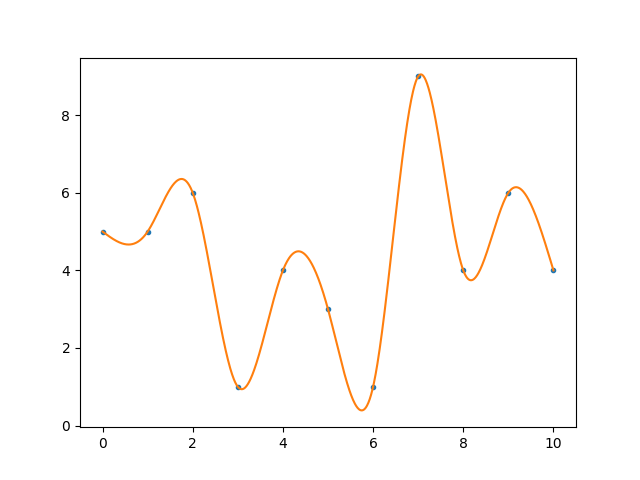

# cubic-spline-interpolation

Insert interpolation points (x,y) in the first few lines of the code and execute it. You'll get a matplotlib plot of a cubic spline with natural boundary condition on both sides.

